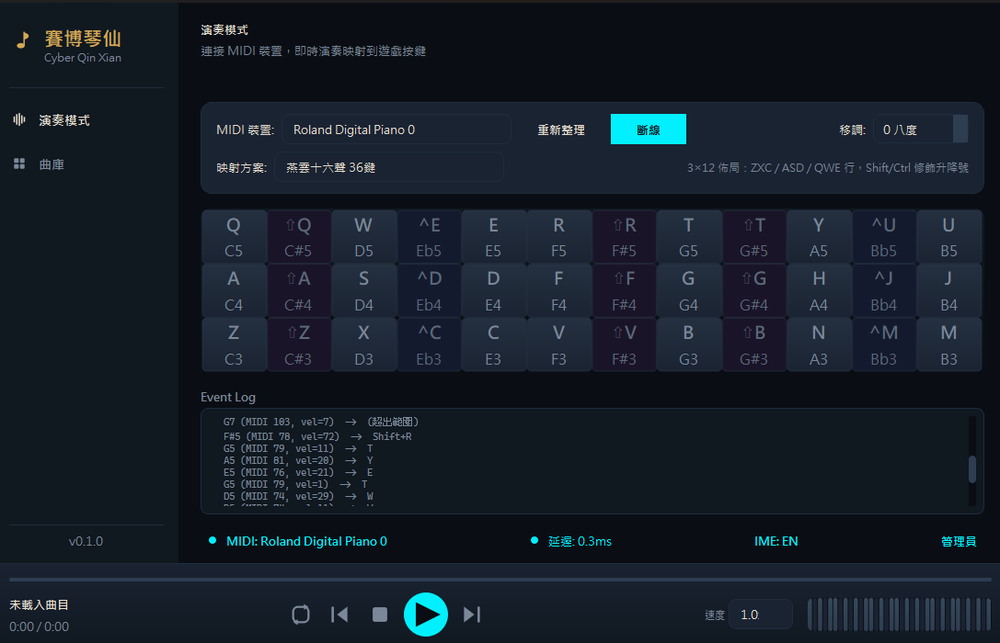

# 賽博琴仙 Cyber Qin Xian

**用真實鋼琴演奏遊戲中的古琴 — Play a real piano, and the game character plays in sync.**

[](https://github.com/EdmondVirelle/cyber-qin/actions/workflows/ci.yml)


---

## 簡介

**賽博琴仙** 是一款即時 MIDI-to-Keyboard 映射工具，專為《燕雲十六聲》(*Where Winds Meet*) 等遊戲設計。將 USB MIDI 鍵盤（如 Roland FP-30X）的琴鍵訊號，以 **< 2ms 延遲** 轉換為 DirectInput 掃描碼按鍵，讓遊戲角色與你的演奏完全同步。

支援五大模式：即時演奏、MIDI 檔案自動播放、即時錄音、虛擬鍵盤編輯、以及完整的 **Piano Roll 編輯器**（beat-based editor）。內建 9 階段智慧預處理管線、錄音後 Auto-Tune 後處理、5 種可切換鍵位方案，以及多軌音符序列模型。

---

## 展示

> **截圖預留區**
>
> 
>
> *即時演奏模式 — 鋼琴鍵盤視覺化 + 低延遲監控*

---

## 功能特色

### 核心能力

| 功能 | 說明 |
|------|------|
| **即時 MIDI 映射** | MIDI callback 直接在 rtmidi 執行緒上觸發 `SendInput`，不經過 Qt 事件佇列，延遲 < 2ms |
| **5 種鍵位方案** | 燕雲十六聲 36 鍵、FF14 32 鍵、通用 24/48/88 鍵，執行時即時切換 |
| **9 階段 MIDI 預處理** | 打擊過濾 → 音軌篩選 → 八度去重 → 智慧移調 → 八度摺疊 → 碰撞去重 → 複音限制 → 力度正規化 → 時間量化 |
| **MIDI 檔案自動播放** | 匯入 `.mid` 檔案，0.25x - 2.0x 變速控制，可拖曳進度條，4 拍節拍器倒數，循環 / 單曲重複 |
| **即時 MIDI 錄音** | 錄製演奏並儲存為 `.mid` 檔案，錄音後可做 Auto-Tune（節拍量化 + 音階校正） |
| **Piano Roll 編輯器** | Beat-based 多軌 piano roll，多選/框選/拖曳調整大小/複製貼上/快捷鍵、軌道面板、音高尺、播放游標、專案存檔 |
| **虛擬鍵盤輸入** | 可互動鋼琴點選輸入音符，NoteRoll 時間軸視覺化 |
| **修飾鍵閃擊技術** | `Shift↓ → Key↓ → Shift↑` 以單一批次送出，防止修飾鍵污染後續和弦 |
| **自動重連** | MIDI 裝置斷線時每 3 秒輪詢，插回自動恢復 |
| **卡鍵看門狗** | 偵測按住超過 10 秒的按鍵並自動釋放，防止遊戲內角色卡死 |

### Piano Roll 編輯器

| 功能 | 說明 |
|------|------|
| **Beat-based 時間模型** | 所有音符位置以拍為單位（float），BPM 變更不會破壞音符位置 |
| **多軌系統** | 預設 4 軌、最多 12 軌，12 色色盤，per-track mute/solo/channel |
| **軌道面板** | 左側面板顯示軌道列表，支援 mute/solo 切換、雙擊重命名、右鍵刪除、拖曳排序 |
| **音高尺** | 左側 PitchRuler 顯示 C3..B5 音名，黑鍵暗底，與 NoteRoll Y 軸完美對齊 |
| **多選模式** | Ctrl+click 切換選擇、Shift+拖曳框選（marquee selection）、Ctrl+A 全選 |
| **音符調整大小** | 滑鼠移到音符右邊緣自動切換游標，拖曳即可調整持續時間 |
| **音符標籤** | 放大後音符上顯示音名（C4、D#5 等） |
| **批次拖曳** | 拖曳已選音符時，所有選取的音符一起移動 |
| **時值預設** | 全音符 / 二分 / 四分 / 八分 / 十六分，鍵盤快捷鍵 1-5 |
| **休止符視覺化** | 紅色半透明長條（按 `0` 輸入），明確區分有聲/無聲 |
| **Ghost Notes** | 非活躍軌道音符以 20% 透明度顯示，提供上下文 |
| **完整快捷鍵** | Ctrl+C/X/V/D（複製/剪下/貼上/複製）、方向鍵移動/Shift+方向鍵調整大小、Delete 刪除 |
| **Undo / Redo** | 100 步歷史，Ctrl+Z / Ctrl+Y，支援軌道操作的還原 |
| **拍號支援** | 4/4、3/4、2/4、6/8、4/8，格線自動調整 |
| **專案檔案** | `.cqp` 格式（JSON + gzip），Ctrl+S 儲存 / Ctrl+Shift+S 另存新檔 |
| **自動儲存** | 每 60 秒自動儲存至 `~/.cyber_qin/autosave.cqp` |
| **播放游標** | 播放時即時顯示當前位置，拍→秒自動轉換 |
| **Snap-to-Grid** | 音符移動/調整大小自動吸附到拍線 |

### 使用者介面

| 功能 | 說明 |
|------|------|
| **賽博墨韻主題** | 武俠賽博龐克暗色主題，霓虹青 (`#00F0FF`) + 宣紙白暖色調 |
| **自訂應用程式圖示** | 自訂插畫 icon.png 轉換為多尺寸 .ico，取代 QPainter 產生的圖示 |
| **動態鋼琴鍵盤** | 即時顯示按鍵狀態，帶霓虹光暈動畫效果 |
| **曲庫管理** | 匯入、搜尋、依名稱 / BPM / 音符數 / 時長排序 |
| **底部播放列** | Spotify 風格，含迷你鋼琴、進度條、速度控制 |

---

## 系統架構

### 資料流

```
                          即時演奏模式
┌─────────────┐    USB    ┌──────────────┐  callback  ┌───────────┐  lookup  ┌──────────────┐  SendInput  ┌──────┐
│ Roland FP-30X│─────────→│ python-rtmidi │──────────→│ KeyMapper │────────→│ KeySimulator │───────────→│ Game │
└─────────────┘           └──────────────┘            └───────────┘         └──────────────┘            └──────┘
                            (rtmidi thread)                                  (scan codes)
                                  │
                           Qt signals (async)
                                  │
                         Qt Main Thread → GUI 更新


                          自動播放模式
┌───────────┐  parse  ┌─────────────────┐  preprocess  ┌──────────────────┐  timed events  ┌──────────────┐
│ .mid 檔案 │────────→│ MidiFileParser  │────────────→│ MidiPreprocessor │──────────────→│ PlaybackWorker│
└───────────┘         └─────────────────┘              └──────────────────┘               └──────┬───────┘
                                                                                                 │
                                                              lookup + SendInput                 │
                                                       ┌───────────┬──────────────┐←────────────┘
                                                       │ KeyMapper │ KeySimulator │→ Game
                                                       └───────────┴──────────────┘


                          Piano Roll 編輯器
┌──────────────────────────────────┐  beat-based  ┌────────────────┐  save/load  ┌──────────────┐
│ EditorView                       │─────────────→│ EditorSequence │────────────→│ project_file │→ .cqp
│ ┌────────────┬─────────┬───────┐│              │ (BeatNote/Rest)│             └──────────────┘
│ │TrackPanel  │PitchRuler│NoteRoll││←─────────────│ multi-track    │
│ │(mute/solo) │(C3..B5)  │(piano ││  undo/redo   │ copy/paste     │  to_midi  ┌──────────────┐
│ │            │          │ roll) ││              │ multi-select   │──────────→│ MidiWriter   │→ .mid
│ └────────────┴─────────┴───────┘│              │ resize/marquee │           └──────────────┘
│ [          ClickablePiano       ]│              └────────────────┘
└──────────────────────────────────┘
```

### 延遲最佳化路徑

```
MIDI Note On 訊號
    │
    ├── [rtmidi C++ thread] ← SetThreadPriority(TIME_CRITICAL)
    │       │
    │       ├── KeyMapper.lookup()        ~0.01ms  (dict 查表)
    │       ├── KeySimulator.press()      ~0.05ms  (SendInput syscall)
    │       └── Qt signal emit            ~0.00ms  (跨執行緒佇列，非同步)
    │
    └── 總延遲: < 2ms (MIDI USB polling + callback + SendInput)

    ※ GUI 更新走 Qt 訊號佇列，不佔用關鍵路徑
```

---

## 技術棧

| 層級 | 技術 | 用途 |
|------|------|------|
| **MIDI I/O** | `mido` + `python-rtmidi` | MIDI 裝置通訊、`.mid` 檔案解析 |
| **鍵盤模擬** | `ctypes` + Win32 `SendInput` | DirectInput 掃描碼按鍵注入 |
| **GUI** | PyQt6 | 桌面介面、事件迴圈、跨執行緒訊號 |
| **建置** | PyInstaller | 單資料夾可執行檔封裝 |
| **CI/CD** | GitHub Actions | 多版本測試 + tag 自動發佈 |
| **程式碼品質** | Ruff + pytest | Linting + 450 項測試 |

---

## 快速開始

### 系統需求

- **作業系統**: Windows 10 / 11（DirectInput 掃描碼僅 Windows 支援）
- **Python**: 3.11 或以上
- **MIDI 裝置**: 任何 USB MIDI 鍵盤（已測試 Roland FP-30X）
- **權限**: 需要以 **系統管理員** 身分執行（`SendInput` 對 DirectInput 遊戲需要提權）

### 安裝

```bash
# 1. 複製專案
git clone https://github.com/EdmondVirelle/cyber-qin.git
cd cyber-qin

# 2. 安裝（含開發依賴）
pip install -e .[dev]
```

### 執行

```bash
# 以管理員身分執行
cyber-qin
```

> **提示**: 若未以管理員身分執行，`SendInput` 對全螢幕 DirectInput 遊戲的按鍵注入會靜默失敗。

### 建置獨立執行檔

```bash
.venv313/Scripts/pyinstaller cyber_qin.spec --clean -y
# 輸出: dist/賽博琴仙/ (~95 MB)
```

---

## 開發

### 測試

```bash
# 執行全部 450 項測試（11 個測試檔案）
pytest

# 詳細輸出
pytest -v
```

測試完全模擬 `ctypes.windll` 和 `rtmidi`，不需要實體硬體即可執行。

### Lint

```bash
# 檢查
ruff check .

# 自動修復
ruff check --fix .
```

### 專案統計

| 指標 | 數值 |
|------|------|
| 原始碼行數 | ~10,300 LOC |
| 測試碼行數 | ~4,100 LOC |
| 模組數量 | 45 |
| 測試數量 | 450 |
| 測試檔案 | 11 |
| 測試涵蓋平台 | Python 3.11 / 3.12 / 3.13 |

---

## 專案結構

```
cyber_qin/
├── core/                        # 平台無關核心邏輯
│   ├── constants.py             # Win32 掃描碼、MIDI 範圍、計時常數
│   ├── key_mapper.py            # MIDI 音符 → 按鍵映射查表
│   ├── key_simulator.py         # ctypes SendInput 封裝（DirectInput 掃描碼）
│   ├── midi_listener.py         # python-rtmidi 即時輸入 + 自動重連
│   ├── midi_file_player.py      # MIDI 檔案播放引擎（精準計時 + 4 拍倒數）
│   ├── midi_preprocessor.py     # 9 階段預處理管線
│   ├── midi_recorder.py         # 即時 MIDI 錄音引擎
│   ├── midi_writer.py           # 錄音結果匯出 .mid 檔案
│   ├── auto_tune.py             # 錄音後處理：節拍量化 + 音階校正
│   ├── beat_sequence.py         # Beat-based 多軌音符序列模型（編輯器核心）
│   ├── midi_output_player.py    # MIDI 輸出播放器（編輯器播放預覽）
│   ├── project_file.py          # 專案檔案存取（.cqp = JSON + gzip）
│   ├── note_sequence.py         # 秒制音符序列模型（舊版編輯器）
│   ├── mapping_schemes.py       # 5 種可切換鍵位方案註冊表
│   └── priority.py              # 執行緒優先權 + 高解析度計時器
├── gui/                         # PyQt6 使用者介面
│   ├── app_shell.py             # QMainWindow 主框架（Spotify 風格佈局）
│   ├── icons.py                 # QPainter 向量圖示提供器（23 種圖示）
│   ├── theme.py                 # 「賽博墨韻」暗色主題系統
│   ├── views/
│   │   ├── live_mode_view.py    # 即時演奏頁面（含錄音控制）
│   │   ├── library_view.py      # 曲庫管理頁面
│   │   └── editor_view.py       # Piano Roll 編輯器頁面
│   └── widgets/
│       ├── piano_display.py     # 動態鋼琴鍵盤（霓虹光暈效果）
│       ├── mini_piano.py        # 底部迷你鋼琴視覺化
│       ├── clickable_piano.py   # 可互動鋼琴（點選輸入音符）
│       ├── note_roll.py         # Beat-based piano roll（多選/框選/resize）
│       ├── pitch_ruler.py       # 音高尺（C3..B5 音名標示）
│       ├── editor_track_panel.py # 軌道面板（mute/solo/重命名/排序）
│       ├── sidebar.py           # 側邊欄導航
│       ├── now_playing_bar.py   # 底部播放控制列
│       ├── track_list.py        # 曲目清單元件
│       ├── progress_bar.py      # 可拖曳進度條
│       ├── speed_control.py     # 播放速度控制器
│       ├── log_viewer.py        # 即時事件日誌
│       ├── status_bar.py        # 狀態列
│       └── animated_widgets.py  # 動畫基礎元件（IconButton 等）
└── utils/
    ├── admin.py                 # UAC 提權檢查
    └── ime.py                   # 輸入法偵測
```

---

## 技術深潛

### 1. 延遲最佳化：為何不走 Qt 事件佇列

遊戲演奏的核心需求是 **低延遲** — 從按下琴鍵到遊戲角色出聲，玩家可感知的上限約 10ms。

典型架構會將 MIDI 事件透過 Qt 訊號傳遞到主執行緒再處理，但 Qt 的事件佇列在 GUI 繁忙時（如重繪動畫）可能引入 5-15ms 的額外延遲。

本專案的做法是 **直接在 rtmidi 的 C++ callback 執行緒上** 執行鍵盤模擬：

```python
# app_shell.py — MidiProcessor.on_midi_event()
# 此函式在 rtmidi callback thread 上執行

def on_midi_event(self, event_type, note, velocity):
    # 1. 首次呼叫時提升執行緒優先權
    if not self._priority_set:
        set_thread_priority_realtime()  # TIME_CRITICAL
        self._priority_set = True

    # 2. 關鍵路徑：查表 + SendInput（< 0.1ms）
    if event_type == "note_on":
        mapping = self._mapper.lookup(note)      # dict lookup
        if mapping is not None:
            self._simulator.press(note, mapping)  # SendInput syscall

    # 3. GUI 更新走非同步訊號（不阻塞關鍵路徑）
    self.note_event.emit(event_type, note, velocity)
```

配合 `timeBeginPeriod(1)` 將系統計時器解析度降至 1ms，以及 `SetThreadPriority(TIME_CRITICAL)` 提升執行緒排程優先權，實現端到端 < 2ms 延遲。

### 2. 修飾鍵閃擊技術（Modifier Flash）

遊戲的 36 鍵模式使用 Shift / Ctrl 修飾鍵表示升降號。若在和弦中先按下 Shift 再按 Key，Shift 可能「洩漏」到同時按下的其他音符，導致遊戲誤判按鍵。

解決方案：將修飾鍵的按下與釋放 **包裹在同一次 `SendInput` 批次呼叫** 中：

```python
# key_simulator.py — KeySimulator.press()

def press(self, midi_note, mapping):
    mod_scan = _modifier_scan(mapping.modifier)
    if mod_scan is not None:
        # 三個事件作為一個原子批次送出
        _send(
            _make_input(mod_scan, key_up=False),           # Shift ↓
            _make_input(mapping.scan_code, key_up=False),  # Key ↓
            _make_input(mod_scan, key_up=True),            # Shift ↑
        )
    else:
        _send(_make_input(mapping.scan_code, key_up=False))
```

`SendInput` 的設計保證同一批次中的事件不會被其他行程的輸入事件插隊，確保修飾鍵的作用範圍精確限定在單一按鍵上。

### 3. 智慧 MIDI 預處理管線（9 階段）

將任意 MIDI 檔案適配到遊戲有限的音域範圍（如 36 鍵 = C3-B5），需要一套自動化的音符轉換管線：

```
原始 MIDI 事件
    │
    ├── Stage 1: 打擊過濾        移除 GM channel 10 鼓組事件
    ├── Stage 2: 音軌篩選        只保留使用者選取的音軌
    ├── Stage 3: 八度去重        同一時間同一 pitch class → 保留最高的
    ├── Stage 4: 智慧全曲移調    嘗試 ±48 半音（步進 12），選最佳位移
    ├── Stage 5: 八度摺疊        將超出範圍的音符摺入可演奏區間
    ├── Stage 6: 碰撞去重        velocity 優先 — 碰撞時保留力度最高的
    ├── Stage 7: 複音限制        上限 N 聲部，保留最高 + 最低（bass anchor）
    ├── Stage 8: 力度正規化      所有 note_on 力度統一為 127
    └── Stage 9: 時間量化        對齊 60fps 格線（~16.67ms），消除微延遲
    │
    ▼
處理後事件（按時間排序，note_off 優先於 note_on）
```

### 4. Piano Roll 編輯器資料模型

`EditorSequence` 以**拍**為時間單位，支援完整的多軌編輯操作：

```python
@dataclass
class BeatNote:
    time_beats: float      # 以拍為單位的絕對位置
    duration_beats: float  # 以拍為單位的持續時間
    note: int              # MIDI 0-127
    velocity: int = 100
    track: int = 0

# 拍轉秒：time_seconds = time_beats * (60.0 / tempo_bpm)
```

核心操作包括：`add_note` / `move_notes` / `resize_notes` / `delete_items` / `copy_items` / `reorder_tracks` / `undo` / `redo`，每個操作都是單一 undo 步驟。快照（`_Snapshot`）包含完整的 notes、rests、tracks 資料，確保任何操作都能完整還原。

### 5. ctypes INPUT 結構體陷阱

Windows `SendInput` API 要求 `INPUT` 結構體的大小精確為 40 bytes（64-bit）。結構體內部使用 union 包含 `MOUSEINPUT`、`KEYBDINPUT`、`HARDWAREINPUT` 三種類型。

若 union 中 **省略了最大的成員 `MOUSEINPUT`**（32 bytes），`sizeof(INPUT)` 會變成 32 而非 40，導致 `SendInput` **靜默返回 0** 且不送出任何按鍵 — 不報錯、不丟例外，只是完全無效。

```python
# 必須包含 MOUSEINPUT 作為 union 成員
class INPUT(ctypes.Structure):
    class _INPUT_UNION(ctypes.Union):
        _fields_ = [
            ("mi", MOUSEINPUT),      # ← 最大成員，決定 union 大小
            ("ki", KEYBDINPUT),
            ("hi", HARDWAREINPUT),
        ]
    _anonymous_ = ("_union",)
    _fields_ = [("type", ctypes.wintypes.DWORD), ("_union", _INPUT_UNION)]
```

---

## CI/CD

### 持續整合

每次推送至 `main` 或開啟 Pull Request 時自動執行：

| 工作 | 環境 | 內容 |
|------|------|------|
| **測試** | `windows-latest` x Python 3.11 / 3.12 / 3.13 | `pip install -e .[dev]` → `pytest -q` |
| **Lint** | `ubuntu-latest` x Python 3.13 | `ruff check .` |

### 自動發佈

推送 `v*` 標籤時觸發：

1. 安裝依賴 + 生成圖示
2. PyInstaller 建置（`onedir` + `windowed` + `uac_admin`）
3. 壓縮為 `.zip`
4. 建立 GitHub Release 並上傳附件

```bash
# 觸發一次發佈
git tag v0.7.2
git push origin v0.7.2
```

---

## 鍵位方案一覽

| 方案 | 鍵數 | MIDI 範圍 | 佈局 | 適用遊戲 |
|------|------|-----------|------|----------|
| **燕雲十六聲 36 鍵** | 36 | C3 - B5 | 3 x 12 (ZXC / ASD / QWE + Shift/Ctrl) | 燕雲十六聲 |
| **FF14 32 鍵** | 32 | C3 - G5 | 4 x 8 (ASDF / QWER / 1234 / Ctrl+1~8) | Final Fantasy XIV |
| **通用 24 鍵** | 24 | C3 - B4 | 2 x 12 (ZXC / QWE + Shift/Ctrl) | 通用 |
| **通用 48 鍵** | 48 | C2 - B5 | 4 x 12 (數字行 / ZXC / ASD / QWE) | 通用 |
| **通用 88 鍵** | 88 | A0 - C8 | 8 x 11 (多層 Shift/Ctrl 組合) | 通用（全鋼琴） |

---

## 編輯器快捷鍵

| 快捷鍵 | 動作 |
|--------|------|
| `1` - `5` | 選擇時值（全音符 → 十六分音符） |
| `0` | 輸入休止符 |
| `Ctrl+Z` / `Ctrl+Y` | Undo / Redo |
| `Ctrl+A` | 全選 |
| `Ctrl+C` / `Ctrl+X` / `Ctrl+V` | 複製 / 剪下 / 貼上 |
| `Ctrl+D` | 複製選取 |
| `Ctrl+S` / `Ctrl+Shift+S` | 儲存 / 另存新檔 |
| `Ctrl+E` | 匯出 .mid |
| `←` `→` | 移動選取（時間軸） |
| `↑` `↓` | 移動選取（音高） |
| `Shift+←` `Shift+→` | 調整選取大小 |
| `Delete` | 刪除選取 |
| `Space` | 播放 / 暫停 |
| `Ctrl+滾輪` | 縮放 |
| `Shift+拖曳` | 框選 |
| `Ctrl+click` | 切換選取 |

---

## 版本歷程

### v0.7.1 — 自訂應用程式圖示 + 製作者署名
- 替換應用程式圖示為自訂插畫（icon.png → 多尺寸 .ico）
- 簡化 `generate_icon.py`，改從 PNG 轉換（不再需要 PyQt6）
- Sidebar 底部新增「燕雲十六聲 · 葉微雨 製作」署名
- 版本 0.7.0 → 0.7.1

### v0.7.0 — 編曲器 UX 大改 + PyInstaller 修復
- **多選/框選** — Ctrl+click 切換選取、Shift+拖曳 marquee selection、Ctrl+A 全選
- **音符調整大小** — 右邊緣拖曳、Shift+方向鍵批次調整
- **音符標籤** — 放大後顯示音名（C4、D#5）
- **軌道面板** — `EditorTrackPanel` 支援 mute/solo 切換、重命名、拖曳排序、新增/刪除
- **音高尺** — `PitchRuler` 左側顯示 C3..B5 音名，黑鍵暗底
- **專案檔案** — `.cqp` 格式（JSON + gzip），Ctrl+S/Shift+S 儲存、自動儲存（60 秒）
- **MIDI 輸出播放器** — 編輯器內播放預覽
- **PyInstaller 修復** — 補齊 17 個缺失的 hiddenimports
- **完整快捷鍵** — Ctrl+C/X/V/D、方向鍵、Delete、Space 等
- 450 項測試全過（+58）

### v0.6.0 — Piano Roll 完整升級
- **多選/框選** — Ctrl+click 切換選取、Shift+拖曳 marquee selection、Ctrl+A 全選
- **音符調整大小** — 右邊緣拖曳、Shift+方向鍵批次調整
- **音符標籤** — 放大後顯示音名（C4、D#5）
- **軌道面板** — `EditorTrackPanel` 支援 mute/solo 切換、重命名、拖曳排序、新增/刪除
- **音高尺** — `PitchRuler` 左側顯示 C3..B5 音名，黑鍵暗底
- **專案檔案** — `.cqp` 格式（JSON + gzip），Ctrl+S/Shift+S 儲存、自動儲存（60 秒）
- **播放游標** — 編輯器內顯示播放位置
- **批次操作** — `resize_notes`、`delete_items`、`copy_items`、`reorder_tracks` 全部支援 undo
- **`_Snapshot` 含 tracks** — 修復 `remove_track` undo 的既有 bug
- **完整快捷鍵** — Ctrl+C/X/V/D、方向鍵、Delete、Space 等
- 新增 3 個向量圖示（mute/solo/save）
- 392 項測試全過

### v0.5.0 — 拍號制編輯器 + SDD 設計文件
- `EditorSequence` — beat-based 多軌音符序列模型（BeatNote / BeatRest / Track）
- 重寫 `NoteRoll` — beat grid、bar lines、ghost notes、right-click delete
- 重寫 `EditorView` — 鍵盤快捷鍵（1-5 時值、0 休止符、Ctrl+Z/Y）
- `IconButton` disabled 狀態灰色、undo/redo 圖示
- 還原 Stage 5 為 simple octave fold（移除流水摺疊）
- 366 項測試全過
- EDITOR_SDD.md 設計文件

### v0.4.0 — 流水摺疊、MIDI 錄音、虛擬鍵盤編輯器
- 流水摺疊 voice-leading octave fold（per-channel）
- `MidiRecorder` + `MidiWriter` — 即時錄音 + .mid 匯出
- `AutoTune` — 節拍量化 + 音階校正
- `NoteSequence` — 可變音符序列模型
- `ClickablePiano` + `NoteRoll` — 虛擬鍵盤編輯器

### v0.3.0 — 重複模式 + 前/後曲
- 三種重複模式（關 / 全部循環 / 單曲重複）
- 上/下一首按鈕

### v0.2.0 — 智慧預處理 + 搜尋排序
- 9 階段 MIDI 預處理管線
- 曲庫搜尋/排序
- GitHub Actions CI/CD

### v0.1.0 — 初始版本
- 即時 MIDI 映射 + 自動播放
- 賽博墨韻暗色主題
- 修飾鍵閃擊技術
- PyInstaller 封裝

---

## 製作者

燕雲十六聲 遊戲 ID: **葉微雨**

如果這個工具對你有幫助，歡迎支持開發者：

[](https://ko-fi.com/virelleedmond)

---

## 致謝

- [mido](https://github.com/mido/mido) — Python MIDI 程式庫
- [python-rtmidi](https://github.com/SpotlightKid/python-rtmidi) — 低延遲跨平台 MIDI I/O
- [PyQt6](https://www.riverbankcomputing.com/software/pyqt/) — Python Qt 6 綁定
- [PyInstaller](https://pyinstaller.org/) — Python 應用程式封裝工具
- [Ruff](https://github.com/astral-sh/ruff) — 極速 Python linter
- 《燕雲十六聲》(*Where Winds Meet*) — 網易旗下 Everstone Studio 開發的武俠開放世界遊戲
